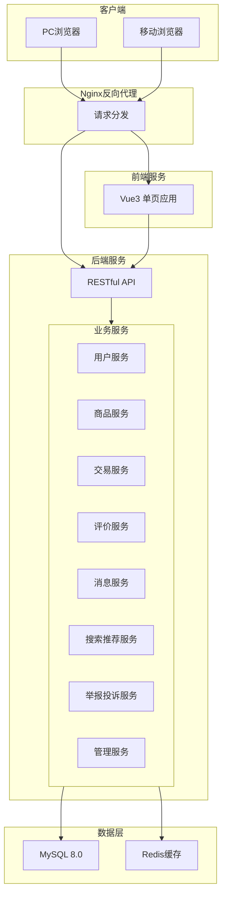
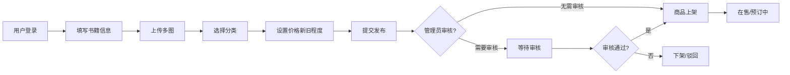
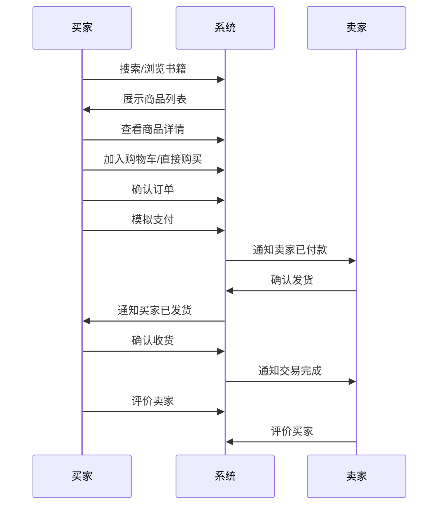
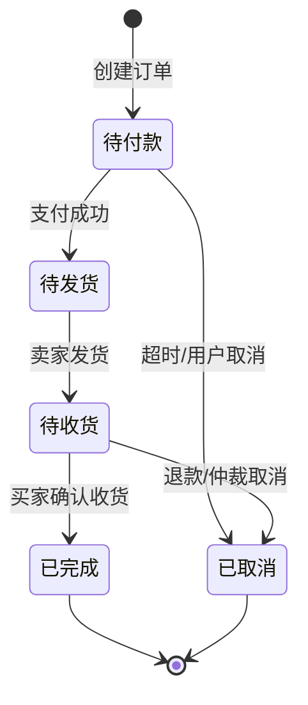

# 架构设计

## 系统概述

校园二手书交易平台采用前后端分离架构，前端使用Vue3构建单页应用，后端使用SpringBoot提供RESTful API。系统分为用户端（前台）和管理端（后台）两大部分，通过Nginx反向代理统一入口。

## 技术栈

### 前端
- **框架**: Vue 3.x + JavaScript
- **UI组件库**: ElementPlus
- **状态管理**: Pinia
- **路由**: Vue Router
- **HTTP客户端**: Axios
- **构建工具**: Vite

### 后端
- **框架**: SpringBoot 2.7.x
- **持久层**: MyBatis-Plus
- **数据库**: MySQL 8.0
- **缓存**: Redis
- **安全**: Spring Security + JWT
- **定时任务**: Quartz（订单超时处理）

### 基础设施
- **容器化**: Docker
- **反向代理**: Nginx
- **日志**: SLF4J + Logback

## 项目结构

```
/workspace
├── frontend/                 # 前端项目
│   ├── src/
│   │   ├── api/            # API接口封装
│   │   ├── assets/         # 静态资源
│   │   ├── components/      # 公共组件
│   │   ├── directives/      # 自定义指令
│   │   ├── filters/         # 过滤器
│   │   ├── layouts/         # 布局组件
│   │   ├── router/          # 路由配置
│   │   ├── stores/          # Pinia状态管理
│   │   ├── utils/           # 工具函数
│   │   ├── views/           # 页面组件
│   │   │   ├── front/       # 用户端页面
│   │   │   │   ├── home/
│   │   │   │   ├── book/
│   │   │   │   ├── cart/
│   │   │   │   ├── order/
│   │   │   │   ├── message/
│   │   │   │   ├── user/
│   │   │   │   └── search/
│   │   │   └── admin/       # 管理端页面
│   │   │       ├── dashboard/
│   │   │       ├── user/
│   │   │       ├── book/
│   │   │       ├── order/
│   │   │       ├── review/
│   │   │       ├── report/
│   │   │       ├── notice/
│   │   │       ├── category/
│   │   │       └── log/
│   │   ├── App.vue
│   │   └── main.js
│   ├── public/
│   ├── vite.config.js
│   └── package.json
│
├── backend/                  # 后端项目
│   ├── src/
│   │   └── main/
│   │       ├── java/com/campus/book/
│   │       │   ├── BookApplication.java
│   │       │   ├── config/           # 配置类
│   │       │   │   ├── SecurityConfig.java
│   │       │   │   ├── RedisConfig.java
│   │       │   │   ├── CorsConfig.java
│   │       │   │   └── WebConfig.java
│   │       │   ├── controller/        # 控制器
│   │       │   │   ├── front/         # 用户端API
│   │       │   │   └── admin/         # 管理端API
│   │       │   ├── service/           # 业务层
│   │       │   │   ├── impl/
│   │       │   │   └── OrderScheduleService.java
│   │       │   ├── mapper/           # 数据访问层
│   │       │   ├── entity/           # 实体类
│   │       │   ├── dto/              # 数据传输对象
│   │       │   ├── vo/               # 视图对象
│   │       │   ├── common/           # 公共组件
│   │       │   │   ├── exception/
│   │       │   │   ├── result/
│   │       │   │   └── constants/
│   │       │   ├── security/         # 安全相关
│   │       │   │   ├── JWT/
│   │       │   │   └── filter/
│   │       │   └── util/              # 工具类
│   │       └── resources/
│   │           ├── mapper/           # MyBatis映射文件
│   │           ├── application.yml
│   │           └── logback-spring.xml
│   └── pom.xml
│
├── docker/                   # Docker配置
│   ├── docker-compose.yml
│   ├── mysql/
│   │   └── init.sql
│   ├── redis/
│   └── nginx/
│       └── nginx.conf
│
└── docs/                     # 项目文档
```

## 核心模块

### 1. 用户模块 (user)
- 用户注册（手机号/邮箱）
- 用户登录（JWT认证）
- 个人信息管理
- 密码修改与找回
- 收货地址管理

### 2. 商品模块 (book)
- 商品发布与编辑
- 商品详情查看
- 商品上下架管理
- 商品分类（多级分类）
- 商品图片上传（多图）
- 兴趣标签关联

### 3. 交易模块 (trade)
- 购物车管理
- 订单创建
- 模拟支付
- 订单状态流转
- 订单超时自动取消
- 物流信息管理

### 4. 评价模块 (review)
- 评价发布
- 评价审核
- 评价展示
- 卖家信用计算

### 5. 消息模块 (message)
- 系统通知
- 交易通知
- 私信/留言
- 消息已读/未读

### 6. 搜索推荐模块 (search)
- 全文检索
- 条件筛选
- 搜索历史
- 热门搜索
- Feed流推荐
- 兴趣标签推荐

### 7. 举报投诉模块 (report)
- 商品举报
- 用户投诉
- 建议反馈

### 8. 管理后台 (admin)
- 仪表盘/数据概览
- 用户管理
- 商品审核与管理
- 订单管理
- 评价管理
- 举报投诉处理
- 系统公告管理
- 分类管理
- 操作日志
- 系统监控

## 系统架构图



## 核心流程

### 商品发布流程



### 购买交易流程



### 订单状态流转



## 设计决策

### 1. 前后端分离架构
**决策**: 采用完全前后端分离，前端Vue3单页应用 + 后端SpringBoot RESTful API
**理由**: 
- 支持同时适配PC和移动端
- 便于前后端独立开发和部署
- 提高系统可扩展性和可维护性

### 2. JWT认证
**决策**: 使用JWT实现无状态认证
**理由**:
- 支持分布式部署
- 减少服务器会话存储压力
- Token可包含用户权限信息

### 3. Redis缓存策略
**决策**: Redis用于会话管理、热门商品排序、Feed流推送、搜索缓存
**理由**:
- 高性能读写
- 支持丰富的数据结构
- 满足实时性要求

### 4. 模拟支付
**决策**: 不对接真实支付接口，采用模拟支付流程
**理由**:
- 简化开发和测试
- 避免支付接口对接成本
- 聚焦核心交易流程

### 5. 站内私信简化实现
**决策**: 采用留言板/私信模式，非企业级长链接
**理由**:
- 降低系统复杂度
- 满足基本沟通需求
- 减少运维成本

### 6. 多级商品分类
**决策**: 建立多级分类体系（教材/教辅/文学/科技等），支持动态管理
**理由**:
- 便于商品管理和检索
- 适应业务发展变化
- 提高用户体验
